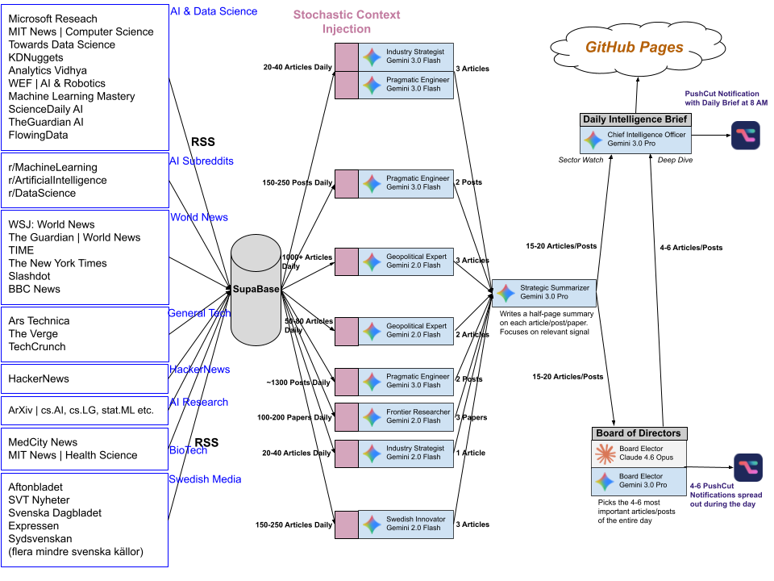

# Gideon: An Intelligence Collection Swarm

Gideon is an **Agentic AI Swarm** designed to solve the information overload problem in the technology sector, especially in AI/ML. It functions as an autonomous research analyst, running on a rigid schedule to ingest, analyze, rank, and synthesize thousands of daily data points into a high-density intelligence briefing, [**which you can read by clicking here.**](https://alfredsjoqvist.github.io/gideon-300/)

Unlike standard "summary bots" that simply shorten text, Gideon employs a **multi-stage consensus architecture**. Different AI agents (personas) critique news based on specific strategic frameworks before a "Board of Directors" (an ensemble of SOTA models) takes a final vote on what matters. This multi-agent debate framework significantly reduces hallucination rates and improves alignment compared to single-model inference (Ki et al., 2025).

---

### Agentic Reasoning Pipeline

### Details

The system is built as a **Linear Filtering Funnel**, reducing noise by 99% to extract the 1% of high-signal information.

#### 1. Automated ETL & Normalization
* **Infrastructure:** Runs on **GitHub Actions** via a scheduled cron job (Zero-infrastructure maintenance).
* **Process:** A robust Python scraper (`ingest.py`) polls high-volume RSS streams (ArXiv, HackerNews, Reddit, Ars Technica, The Guardian, and many more).
* **Data Handling:** It handles rate limiting, parses heterogeneous feed formats, normalizes metadata, and performs "upsert" operations into a **PostgreSQL** warehouse (Supabase) to ensure idempotency.

#### 2. Agentic Filtering
Raw articles are batched and sent to specialized AI Agents defined in `main.py` and `system_prompts.py`. Each agent utilizes **Gemini 2.0 Flash** or **Gemini 3.0 Flash** for high-speed, low-cost reasoning. This architecture aligns with recent findings on using Small Language Models (SLMs) as "intelligent proxies" to optimize signal-to-noise ratios before expensive compute is applied (Zhang et al., 2024).

They do not just "read"; they apply a strict rubric to address the difficulty LLMs face with fine-grained judgment without specific persona-based constraints (Pasquali et al., 2025):
* **Pragmatic Engineer:** Filters forums for immediate technical utility, discarding hype.
* **Frontier Researcher:** Scans ArXiv for novel architectures, ignoring incremental papers.
* **Industry Strategist:** Analyzes industry shifts to identify market signals relevant for long-term career planning and founding companies.
* **Geopolitical Expert:** Analyzes world news for second-order effects on the tech supply chain.
* **Swedish Innovation Scout:** Filters for Nordic ecosystem developments, local regulatory impacts, and startups emerging from the region.
* *Result:* Only articles passing a weighted threshold advance to the next stage.

#### 3. Ensembling (The Board of Directors)
The survivors form a "Master Corpus" of 15-20 articles. To mitigate the bias of a single LLM, Gideon convenes a Dual-Model Board:
* **The Voters:** **Gemini 3 Pro** and **Claude 4.6 Opus** independently review the filtered candidates.
* **The Voting Protocol:** Each model votes on the stories based on "Long-term Civilizational Impact."
* **Fuzzy Matching:** A custom algorithm resolves potential title discrepancies between the different models' outputs to calculate a unified "Ensemble Score." Articles with unanimous support are flagged for **Deep Dives**.

#### 4. Daily Brief Generation
The system separates content into *Deep Dives* (Score ≥ 2) and *Sector Watch* (Score < 2).
* **Prompt Chaining:** A final context-aware prompt generates a structured Markdown briefing.
* **Distribution:**
    * **Web:** Deployed automatically to a **React/Vite** static site hosted on GitHub Pages.
    * **Mobile:** High-priority alerts are pushed via **Pushcut** to iOS, utilizing dynamic hooks generated by Gemini.

---

### Technical Stack

* **Orchestration:** Python 3.10
* **LLMs:** Google GenAI SDK (Gemini 2.0/3.0 Pro/Flash), Anthropic API (Claude 4.6 Opus)
* **Database:** Supabase (PostgreSQL) with `psycopg2`
* **CI/CD:** GitHub Actions (Scheduled Workflows)
* **Frontend:** React, Tailwind CSS, Framer Motion, Vite
* **Extraction:** `trafilatura` (DOM parsing), `feedparser`

### Key Design Patterns used
* **Stochastic Context Shuffling:** Implements a custom batching algorithm that over-samples the corpus and enforces neighborhood diversity. This ensures each article is evaluated in multiple contexts, mitigating the "Lost-in-the-Middle" phenomenon (Bhatia et al., 2024).
* **RAG-lite:** Context injection via PostgreSQL retrieval rather than vector search for deterministic output.
* **Map-Reduce:** Large datasets are mapped to individual agents and reduced to a final briefing.
* **Event-Driven:** The pipeline is triggered chronologically, with strict dependency management between ingestion and analysis layers.

### References

1.  **Bhatia, P. et al. (2024).** *"LaMSUM: Creating Extractive Summaries of User Generated Content using LLMs"*. [View Paper](https://arxiv.org/html/2406.15809v2)
2.  **Ki, J. et al. (2025).** *"Multiple LLM Agents Debate for Equitable Cultural Alignment"*. ACL 2025. [View Paper](https://arxiv.org/abs/2505.24671)
3.  **Pasquali, A. et al. (2025).** *"LLM-Assisted News Discovery in High-Volume Information Streams"*. [View Paper](https://arxiv.org/abs/2509.25491)
4.  **Zhang, Y. et al. (2024).** *"A Comprehensive Survey of Small Language Models"*. [View Paper](https://arxiv.org/abs/2411.03350)